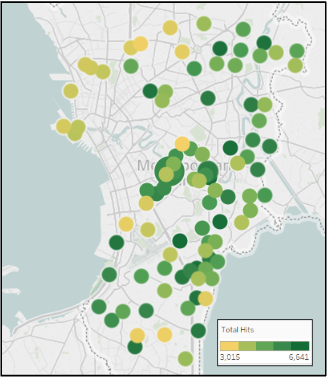
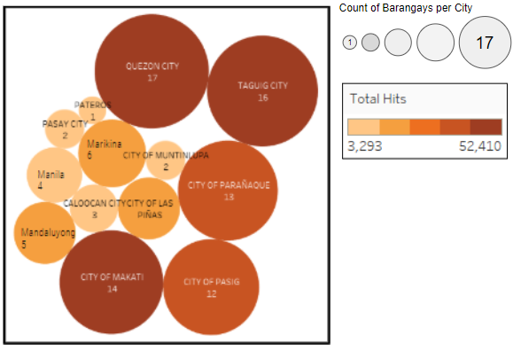
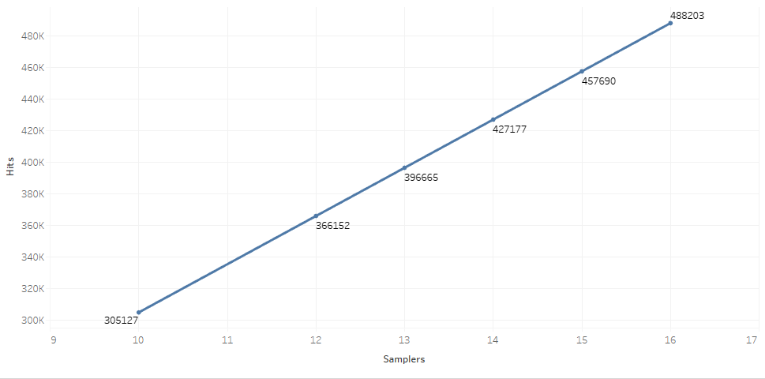
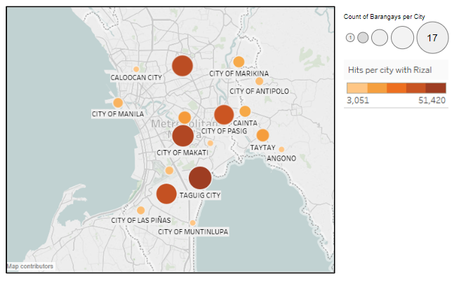
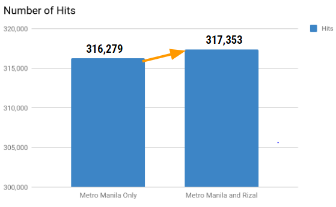
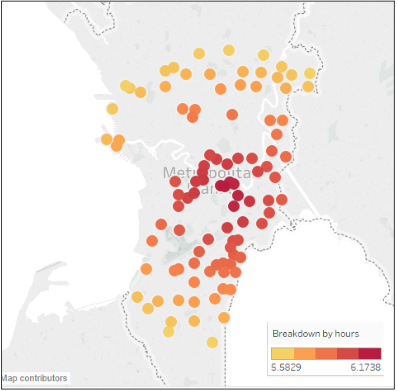
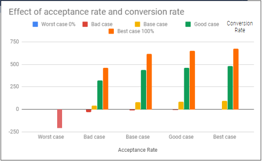

```{r setup, include=FALSE}
knitr::opts_chunk$set(echo = TRUE)
```

## Introduction  

Globe is considering to hire a marketing agency to do a door-to-door sampling caravan project to give
out free prepaid SIM cards to households. The objective is to increase the subscriber base of the company while
obtaining a net profit from this project by hoping that the free SIM card samples will eventually be activated in
the future and revenue will flow from the activated SIMs.   
  
### Sampling Strategy  
The marketing agency proposes to do the following sampling system:  
  
* Ten samplers will be deployed per day to a specific barangay. These samplers are paid minimum
wage by the marketing agency. A limit of one barangay per day is to be visited by the team due
to capacity and planning restrictions.
* A work day is 8 hours from 8am to 5pm. From TGT, the ten samplers will be assembled and at
8am will leave BGC to travel to the selected barangay for that day as a Globe Door-to-Door
Caravan. They have to be back by 5pm at TGT. Lunch break is from 12-1pm.  
* When at the Barangay for the day, the ten samplers will start walking around the Barangay
knocking on houses. Assume that the ten samplers go to different households in different streets
within a Barangay within a day.  
* When a sampler calls on a house and it is answered, the standard spiel to be said is: "Good
morning(afternoon) po, andito po ako ngayon para magbigay ng libreng prepaid SIM from
Globe. May libre po siyang PhP 50.00 load for call, text at saka data. Interested po ba sila?" If
the one that answered the door is interested, the sampler hands a free SIM card. Additionally,
the sampler asks for a signature indicating the SIM has been given away. Maximum of one SIM
card per house.  
* The interaction with a house is composed of 3 parts: 1) Waiting to Answer the Door which
usually takes on average 20 seconds, 2) Spiel Talk Time and 3) Signing time which takes around
10 seconds.  
* If not interested or there is no answer after 30 seconds, then the sampler will move to the next
household. Assume that the Sampler walks on average 4 km/hr. Only 10% of the houses don't
answer.  
* If the sampler was able to provide a SIM to the household, that is considered as a hit. Usually
the success rate of the Samplers claimed by the Marketing Agency is 75%. Which means that
7.5 out of 10 households that answered the door, have accepted the free SIM.  
* Only 25% of the SIMs given away are activated after the sampling and on average will provide
a revenue return of PhP 200.00 per year. The 25% value is called conversion rate, and is
estimated by the Marketing Agency.  
* During the entire sampling project, assume that the Caravan has enough SIMs for the day for
all 10 samplers.  
* A SIM card costs PhP 40.00 to manufacture which includes the initial cost of the PhP 50 credit
load.   
* The agency is proposing a PhP 5,000,000 contract with Globe to do the 100 days of sampling
which includes the salaries of the ten samplers, as well as the company's van and a driver.
(Globe's estimates that the agency spends 10,000 per day for the van's utilization which
includes gas, van rental and driver salary). Note further that the PhP 5,000,000 contract does
not include the costs of the SIM cards.

### Algo and code shiz

Blah blah blah 

#### Loading and preprocessing the data  
Additional R packages are required to properly process the data. These packages contain functions that aren't included in the standard R set of packages.

```{r, results='hide', message=FALSE, warning=FALSE}
chooseCRANmirror(graphics=FALSE, ind=1)

install.packages("geosphere")
install.packages("dplyr")
install.packages("ggplot2")

```

#### Load the Required Libraries  
It is necessary to load the previously installed R packages. Once called, the functions contained in these packages will now be useful.   

```{r  results='hide', message=FALSE, warning=FALSE}
library(dplyr)
library(geosphere)
library(ggplot2)

```

#### Set Working Directory

```{r }
setwd("C:/Users/10012191/Desktop/Reproducible class/ReproducibleClassDiscussion")
```

#### Download dataset
Download the dataset that will be utilized in this research. Subsequently, read the downloaded dataset in R. 

```{r }
download.file (url = 'https://github.com/GlennMatias/ReproducibleClassDiscussion/raw/master/h2h.zip', destfile="h2h.zip")
```

#### Extract the dataset  
```{r }
unzip(zipfile = "./h2h.zip")
```


#### Load the dataset
```{r }
dataset = read.csv("h2h.csv",skip=1)
```


### Processing / Transforming the data  

blah blah blah 

#### Setting the dataset's column headers

```{r }
colnames(dataset) = c("Island","Major_Island","Region","Province","ProvinceCity","CityMunicipcality","Barangay","TotalPopulation","NHouseholds","AreaBarangay","lat","long","Size")
```

#### Subset and get only the NCR Data

```{r }
NCRDataset = subset(dataset,dataset$Region=="NATIONAL CAPITAL REGION") 
```

#### Concatenate City and Brgy into one column
```{r }
NCRDataset$CityBrgy<-paste(NCRDataset$CityMunicipcality,NCRDataset$Barangay,sep="-")
```

#### Assignment of parameters with variables based on given figures by the marketing agency

```{r }
ans <- 0.9			#Answer rate
conv <- 0.25			#Conversion rate
acc <- 0.75			#Acceptance rate
day <- 100			#Number of sampling days
sampler <- 10			#Number of samplers
sim <- 40			#Cost manufacturing 1 sim card
rev <- 200			#Yearly revenue per user
initialCost <- 5000000 	#Initial investment

```

#### Assignment of parameters with variables based on assumptions  

```{r }
projYears <- 5			#Length of financial projection
speedVan <- 33	#Average speed of cars in Metro Manila
spielTotal <- 60        #Average length of time spent per household (if they answer)
spielTotal2 <- 40      #Average length of time spent per household (if no answer)

```

#### Calculate the remaining work hours after/before travel  

Initialize column to contain distance
```{r }
NCRDataset$distanceFromTGT = 0
```

Compute distance from starting point (TGT) to barangay (in meters) and travel time (in hours) 
```{r }
for(i in 1:nrow(NCRDataset)){
      			NCRDataset[i,16] = distm(c(NCRDataset[i, 12], NCRDataset[i,11]), 
c(121.0499,  14.5535), fun = distHaversine) / 1000 
}
NCRDataset$travelTime = ((NCRDataset$distanceFromTGT/33)) # Constant speed of 33 kph
```

Calculate remaining hours by deducting travel time  
```{r }
NCRDataset$availableWorkhoursAfterVanTravel = 8 - (NCRDataset$travelTime * 2)

```

#### Compute for the maximum possible households that the samplers can reach per barangay  

Mutate a column for the maximum possible households  
```{r }
NCRDataset$maxpossible<-(sampler*(NCRDataset$availableWorkhoursAfterVanTravel*3600))/((spielTotal*ans)+(spielTotal2*(1-ans)))
```

Subset the households which have more households than the maximum possible
  
```{r }
NCRDataset<-subset(NCRDataset,NCRDataset$NHouseholds>=NCRDataset$maxpossible)
```


### Data Analysis - Market Feasibility  

blah blah

### Get the top 100 barangays to be visited to maximize the total hits by arranging the barangays with respect to the maximum number of households
 
```{r }
chosenBrgy<-head(arrange(NCRDataset,desc(NCRDataset$maxpossible)),day)
```

### Given the top 100 barangays, compute for the number of hits that can be realistically obtained for 100 days of sampling 

Calculate the total number of hits  
```{r }

chosenBrgy$hits<-ans*chosenBrgy$maxpossible*acc
TotalHits <- sum(chosenBrgy$hits)
```

Calculate the total number of hits by City
```{r }
HitsbyCity <- chosenBrgy %>% group_by(ProvinceCity) %>% summarise(TotalHits = sum(hits))
```

Calculate the total number of hits by region

```{r }
HitsbyRegion <- chosenBrgy %>% group_by(Region) %>% summarise(TotalHits = sum(hits))
```

Calculate the total number of hits per barangay size

```{r }
HitsbyBarangay <- chosenBrgy %>% group_by(Size) %>% summarise(TotalHits = sum(hits))
```


Create a mapping plot for the top 100 barangays to visualize 

```{r, echo=FALSE,fig.align="center", fig.cap="Top 100 barangays", out.width = '40%'}

```
  
Make a shape plot for the number of barangays per city to visualize  
  
```{r, echo=FALSE,fig.align="center", fig.cap="Number of barangays per city", out.width = '60%'}

``` 

Create a line graph for the total number of hits per samplers to visualize  
  
```{r, echo=FALSE,fig.align="center", fig.cap="Total number of hits per samplers", out.width = '80%'}

``` 

#### Check if reaching out to nearby provinces would increase the number of hits  
  
By changing the subset condition and limiting the Major_Island parameter into "GMA" instead of limiting the Region parameter to "NCR", we can identify other potential barangays in the Greater Manila Area to visit.

```{r}

GMADataset<-subset(dataset,dataset$Major_Island=="GMA")

GMADataset$distanceFromTGT = 0
for(i in 1:nrow(GMADataset)){
      GMADataset[i,14] = distm(c(GMADataset[i, 12], GMADataset[i,11]), c(121.0499,  14.5535), fun = distHaversine) / 1000
}
GMADataset$travelTime = ((GMADataset$distanceFromTGT/33))
GMADataset$availableWorkhoursAfterVanTravel = 8 - (GMADataset$travelTime * 2)
GMADataset$CityBrgy<-paste(GMADataset$CityMunicipcality,GMADataset$Barangay,sep="-")
GMADataset$maxpossible<-(10*(GMADataset$availableWorkhoursAfterVanTravel*3600))/((60*0.9)+(40*0.1))
GMADataset<-subset(GMADataset,GMADataset$NHouseholds>=GMADataset$maxpossible)
chosenBrgyProv<-head(arrange(GMADataset,desc(GMADataset$maxpossible)),100)
chosenBrgyProv$hits<-0.9*chosenBrgyProv$maxpossible*0.75
HitsbyCityProv <- chosenBrgyProv %>% group_by(ProvinceCity) %>% summarise(TotalHits = sum(hits))
HitsbyRegionProv <- chosenBrgyProv %>% group_by(Region) %>% summarise(TotalHits = sum(hits))
HitsbyBarangayProv <- chosenBrgyProv %>% group_by(Size) %>% summarise(TotalHits = sum(hits))
TotalHitsProv<-sum(chosenBrgyProv$hits)
```


The percent difference in the total hits is calculated for between the Greater Manila Area and only the National Capital Region

```{r}
Difference<-100*(TotalHitsProv-TotalHits)/TotalHitsProv
```

Create a mapping plot of the top 100 barangays including those in the provinces to visualize

```{r, echo=FALSE,fig.align="center", fig.cap="Top 100 barangays with the provinces", out.width = '60%'}

``` 
Create a mapping plot for the comparison of hits between Rizal and Metro Manila

```{r, echo=FALSE,fig.align="center", fig.cap="Mapping plot for the comparison of hits between Rizal and Metro Manila", out.width = '60%'}

``` 

### Data Analysis - Technical Feasibility

#### Get the utilization of samplers

Transform the data needed for interacting time, walking time and travelling time


```{r}
Case3<-as.data.frame(chosenBrgy$CityBrgy)
colnames(Case3)<-"CityBrgy"
Case3$travelTime<-chosenBrgy$travelTime*2*60
Case3$maxpossible<-chosenBrgy$maxpossible
Case3$hits<-chosenBrgy$hits
Case3$InteractingTime<-Case3$maxpossible*ans*50/60
Case3$WalkingTime<-Case3$maxpossible*sampler/60

```

Create a mapping plot for the Interacting time breakdown of the samplers per hour to visualize  
  
```{r, echo=FALSE,fig.align="center", fig.cap="Mapping plot for the Interacting time breakdown of the samplers per hour", out.width = '60%'}

``` 


#### Increasing the number of samplers


```{r fig.align = "center"}
comparisonSamplers<-as.data.frame(1:7)
colnames(comparisonSamplers)<-"NSamplers"
comparisonSamplers[,1]<-10:16
comparisonSamplers$Hits<-0
comparisonSamplers$Wages<-comparisonSamplers$NSamplers*537*day

for (i in 10:16){ NCRDataset$maxpossible<-(i*(NCRDataset$availableWorkhoursAfterVanTravel*3600))/((spielTotal*ans)+(spielTotal2*(1-ans)))
      NCRDataset<-subset(NCRDataset,NCRDataset$NHouseholds>=NCRDataset$maxpossible)
      chosenBrgy<-head(arrange(NCRDataset,desc(NCRDataset$maxpossible)),day)
      chosenBrgy$hits<-ans*chosenBrgy$maxpossible*acc
      TotalHits<-sum(chosenBrgy$hits)
      comparisonSamplers[i-9,2]<-TotalHits
}

g<-ggplot(comparisonSamplers,aes(NSamplers,Hits))
g+geom_col()+ggtitle("Hits With Varying Number of Samplers")

```

### Data Analysis - Financial Feasibility

#### Project the Return on Investment (ROI) and Payback Period for 5 years  
  
  
Get the total number of conversions

```{r}
chosenBrgy$conversion <- chosenBrgy$hits*conv
TotalConversion <- sum(chosenBrgy$conversion)
```

Compute for the total manufacturing cost of sim cards 
```{r}
totalSimcost <- TotalHits*sim
```


Calculate the total revenue per year 

```{r}
totalRevenuePerYear <- TotalConversion*rev

```

Get the total investment based on initial investment and sim card manufacturing cost

```{r}
totalInvestment <- initialCost+totalSimcost

```

Compute for the cumulative profit

```{r}
cumulativeNIBT <- totalRevenuePerYear*projYears
```

Make a line graph for the cumulative investment and cumulative Profit  
    
```{r}
ggplot()+
  geom_line(data=fincum,aes(y=CumInv/1000000,x= year,colour="red"),size=1 )+
  geom_line(data=fincum,aes(y=CumProf/1000000,x= year,colour="blue"),size=1) +
  scale_color_discrete(name = "Legend", labels = c("Cum Inv", "Cum Prof")) + 
  xlab('Dates') +
  ylab('Cumulative Change in Millions')
```
  
Calculate Return on Investment (ROI)

```{r}
ROI <- ((cumulativeNIBT-totalInvestment)/totalInvestment)*100
```

Get the Payback Period


```{r}
PaybackPeriod <- totalInvestment/totalRevenuePerYear

```

#### Check for the sensitivity of the acceptance and conversion rate to the financial feasibility

Vary the acceptance and conversion rate (by +/- 50%) simultaneously and compute the ROI and Payback Period (The values used in the simulation are summarized below)

```{r}
varmatrixROI<-matrix(nrow=6,ncol=6)
varmatrixROI[1,]<-c(0,0,0.125,0.25,0.75,1)
varmatrixROI[,1]<-c(0,0,0.375,0.75,0.875,1)

varmatrixPB<-matrix(nrow=6,ncol=6)
varmatrixPB[1,]<-c(0,0,0.125,0.25,0.75,1)
varmatrixPB[,1]<-c(0,0,0.375,0.75,0.875,1)

convmatrix<-as.data.frame(c(0,0,0.125,0.25,0.75,1))
accmatrix<-as.data.frame(c(0,0,0.375,0.75,0.875,1))
i<-2
j<-2
for (i in 2:6){
      for (j in 2:6) {
            conv<-convmatrix[j,]
            acc<-accmatrix[i,]
            chosenBrgy$hits<-ans*chosenBrgy$maxpossible*acc
            TotalHits<-sum(chosenBrgy$hits)
            TotalConversion <- TotalHits*conv
            totalSimcost <- TotalHits*sim
            totalRevenuePerYear <- TotalConversion*rev
            totalInvestment <- initialCost+totalSimcost
            cumulativeNIBT <- totalRevenuePerYear*projYears
            varmatrixROI[i,j] <- ((cumulativeNIBT-totalInvestment)/totalInvestment)*100
            varmatrixPB[i,j] <- totalInvestment/totalRevenuePerYear
      }
      
}
```


Plot the calculated ROIs and Payback Periods to visualize the effect of changing the acceptance and conversion rate


```{r, echo=FALSE,fig.align="center", fig.cap="Effect of acceptance rate and conversion rate on Return On Investment", out.width = '60%'}

``` 

